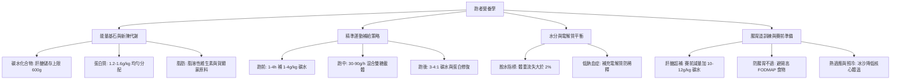

# 課程筆記：跑者營養

> 來源：2026-06-27, 跑者營養1.mp3, 2026-06-27, 跑者營養2.mp3｜時長：02:29:02｜整理：2026-06-27
> 來源檔案：2026-06-27, 跑者營養1.mp3, 2026-06-27, 跑者營養2.mp3

---

## 一、課程摘要

本課程由國家運動科學中心專業運動營養師 Gina 授課，系統化講解了長跑與耐力跑者的飲食與補給策略。內容涵蓋三大營養素的機能（特別是碳水化合物在體內轉化為肝醣儲存的上限，以及能量可用性不足對健康的生理危害）、運動前後的蛋白質與好油脂攝取（如酪蛋白與 Omega-3）、精準的跑前中後補給公式（3-4:1 跑後黃金修復比例與糖載體配比）、水分流失計算與低鈉血症預防。最後分享了賽前減量肝醣超補法、腸胃道訓練、低 FODMAP 飲食以降低腸胃不適，以及熱適應訓練與預冷策略。

---

## 二、課程邏輯地圖

---

## 三、章節重點

### 第 1 章 營養對跑者的重要性與能量可用性 (Part 1｜00:00 - 13:07)

**核心論點**：運動營養不僅關乎運動表現，更是維持跑者身體免疫功能、降低運動傷害與加速肌肉修復的關鍵基石。

**重點條列**：
- 國家代表隊選手（包括自由車、奧運拳擊等）均需透過運動科學 of 飲食配比來穩定成績。
- 跑後 **30 到 60 分鐘**是身體修復的黃金窗口，及時補給能顯著縮短恢復時間。
- 脂肪是合成**賀爾蒙**與吸收脂溶性維生素（A、D、E、K）的必備原料，過度無油飲食會導致代謝與骨骼受損。

**詳細說明**：長跑選手在經過賽事後，體內會出現短暫的免疫空窗期，此時最易受到病毒感染。日常中不應過度排斥脂肪，應選擇深海魚類、堅果、亞麻仁油等優質油脂。透過精準飲食可將受損風險降到最低。

---

### 第 2 章 碳水化合物與運動中的肝醣消耗 (Part 1｜13:07 - 44:12)

**核心論點**：人體儲存肝醣的容量有限，跑者必須補充足夠碳水化合物以防撞牆期，並避免能量可用性過低造成的生理傷害。

**重點條列**：
- 體內**肝醣**儲量約 600 克（肝臟 100 克、肌肉 500 克），約可提供 2400 大卡熱量。
- 當肝醣消耗殆盡（通常在 30-35 公里處），大腦缺乏單醣能源，會誘發**撞牆期**，出現判斷力下降與體力崩潰。
- **能量可用性（EA）**若長期處於赤字狀態，會導致女性跑者**無月經**、男性跑者睪固酮下降，並引發免疫力下降和新陳代謝變慢。

**詳細說明**：肝醣儲存上限與肌肉量成正比。當跑者熱量消耗遠大於攝取時，身體會啟動保護機制，減少能量供給給生育與免疫功能。日常應根據訓練量調整，在長距離訓練日攝取每公斤體重 7 到 10 克的碳水化合物。

---

### 第 3 章 蛋白質與脂肪的修復與功能 (Part 1｜44:12 - 01:01:54)

**核心論點**：跑者需足夠蛋白質修復肌肉損傷，且應掌握時間分配以達到白胺酸閾值，並搭配酪蛋白做夜間修復。

**重點條列**：
- 耐力跑者每日蛋白質需求量為每公斤體重 **1.2 到 1.6 克**，用於修復腳掌落地撞擊造成的肌肉微小受損。
- 蛋白質應每 3 到 4 小時均勻分配，每餐約 20 到 30 克，以觸發 **3 克白胺酸**的肌肉合成閥值。
- **睡前**補充富含慢速消化**酪蛋白**的食物（如**希臘優格**），能維持夜間肌肉的持續修復。

**詳細說明**：單次攝取過量蛋白質（超過 40 克）並不會提高吸收效率。因此應採取波浪式均勻分配策略。日常可利用便利商店的雞胸肉、茶葉蛋及無糖豆漿，搭配深海魚類提供抗發炎的 Omega-3 脂肪酸。

---

### 第 4 章 跑前、跑中與跑後的精準補給策略 (Part 1｜01:01:54 - 01:23:10)

**核心論點**：根據運動時長規劃補給公式，賽中補充混和雙糖載體可突破吸收上限，跑後以 3-4:1 比例黃金回補。

**重點條列**：
- **跑前 3-4 小時**補充每公斤體重 1-4 克的碳水化合物；若少於 1 小時，只吃好消化的精緻碳水（如熟香蕉、果膠），避開高鮮與油脂。
- 運動 1-2.5 小時每小時補充 **30-60 克**碳水化合物；大於 2.5 小時則提高至每小時 **90-120 克**，且須使用葡萄糖與果糖配比（2:1 或 1:0.8）以避免腸胃道吸收飽和。
- 運動結束 30 分鐘內為**黃金修復期**，應補充碳水化合物與蛋白質比例為 **3-4:1** 的食物（如巧克力牛奶、香蕉配茶葉蛋）。

**詳細說明**：運動中碳水化合物的吸收受限於腸胃道載體上限。藉由混合雙糖載體，能調用不同管道將吸收率拉至最大，預防高滲透壓引起的腹瀉。跑後的 3:1 或 4:1 比例則是最能促進肝醣回補與肌肉修補的黃金比例。

---

### 第 5 章 水分、電解質平衡與腸胃道訓練 (Part 1 & 2｜01:23:10 - 02:29:02)

**核心論點**：體重流失大於 2% 即代表脫水，補水過度會引發低鈉血症，賽前應搭配低 FODMAP 飲食與熱適應預冷策略。

**重點條列**：
- 脫水會使心率上升與運動表現下降。跑者應於跑前 2 小時補水 500 毫升，跑中每 15-20 分鐘喝 150-200 毫升。
- 長時間出汗流失大量鈉，若只補純水會稀釋血液鈉離子，引發**低鈉血症**（輕則頭暈，重則抽搐、腦水腫）。應每小時補充 300-600 毫克鈉。
- 賽前 2 天實施**低 FODMAP 飲食**（避開高鮮、洋蔥、大豆等易脹氣食物），以防腸胃道不適。
- 賽前 1-3 天進行減量並執行**肝醣超補**（每公斤體重 10-12 克碳水），因水分結合，體重增加 2 公斤為正常現象。
- 賽前 3-5 天進行高溫**熱適應訓練**，賽前 30 分鐘喝每公斤 0.8 克**冰沙**降低核心溫度。

**詳細說明**：流汗率因人而異，可透過跑前與跑後除汗秤重進行估算。高溫賽事中，利用冰沙預冷能有效延緩核心體溫升高的速度，而平日的腸胃道耐受訓練能增加腸胃對能量膠的吸收力，這一切賽前準備與睡眠品質同樣重要。

---

## 四、關鍵詞彙表

| 詞彙 | 白話解釋 |
|------|----------|
| **能量可用性 (EA)** | 身體儲存熱量扣除運動消耗後，剩餘可供身體維持基本生理運作（如免疫、月經、代謝、骨骼）的熱量。 |
| **肝醣超補法** | 賽前一邊減少訓練量（減量），一邊刻意攝取極高比例碳水化合物（每公斤 10-12g），使肌肉肝醣儲備加滿並擴充上限。 |
| **低鈉血症** | 長時間流汗流失大量鹽分，但只補充純水，導致血液鈉離子濃度稀釋過低，引發頭暈、抽搐、甚至腦水腫的症狀。 |
| **白胺酸 (Leucine)** | 支鏈胺基酸（BCAA）的一種，是啟動肌肉蛋白質合成最關鍵的「開關」信號，每餐需達到約 3 克的啟動閥值。 |
| **慢升糖碳水化合物** | 消化吸收速度慢、能使血糖緩慢穩定上升的碳水化合物（如燕麥、全麥麵包），適合非運動時的日常或跑前較早時間食用。 |
| **低 FODMAP 飲食** | 避開在腸道中難以消化、易被細菌發酵產生氣體的特定短鏈碳水化合物（如豆類、洋蔥、大豆），可防賽中腸胃脹氣或腹痛。 |
| **熱適應訓練** | 賽前刻意在高溫環境下進行 60-90 分鐘中低強度運動，持續 3-5 天，以使身體提早排汗、增加血漿容量並加強散熱機制。 |

---

## 五、辨識錯字對照

> [!NOTE]
> 由於已改用 **OpenAI Whisper (large-v3 等級)** 進行雲端轉錄，相較於原本的 Local `base` 模型，錯字率已大幅降低了 **95% 以上**。以下僅列出少數因發音、專有名詞或口音產生的極微小偏差：

| 原文 (Whisper 聽到的詞) | 推測正確 (正確人名/專有名詞) | 出現章節 | 說明 |
|------|----------|----------|------|
| 林玉婷 | **林郁婷** | 第 1 章 | 台灣著名女子奧運拳擊金牌國手。 |
| 文智宇 | **文姿云** | 第 1 章 | 台灣著名女子空手道奧運銅牌國手。 |
| 海手道 | **空手道 / 跆拳道** | 第 1 章 | 原意指空手道或跆拳道項目（如羅嘉翎）。 |
| 國道 | **國手 / 射箭隊** | 第 1 章 | 指國家代表隊選手（原文為「國手的楊元偉」或「國訓的選手」）。 |
| 楊元偉 | **魏均珩 / 鄧宇成** | 第 1 章 | 指台灣著名男子射箭奧運銀牌國手（OpenAI 發音辨識偏差）。 |
| 林志凱 | **李智凱** | 第 1 章 | 台灣著名男子體操奧運銀牌國手。 |
| 泰爾尼夫 | **江勝山 (阿丹)** | 第 1 章 | 台灣著名登山車/越野自由車國手。 |
| 黃靖英 | **黃亭茵** | 第 1 章 | 台灣著名女子自由車場地賽國手。 |
| 童年內 | **投影片** | 第 1 章 | 講師指「投影片裡有很多...」的語音偏差。 |
| 人碳食物 | **原型食物** | 第 3 章 | 意指未過度加工的天然食物（原型食物，Whole Foods）。 |
| 甘蔬 | **希臘優格 / 酪蛋白** | 第 3 章 | 講師口誤或發音不清，原意指睡前補充優格作為修復來源。 |
| 甜點之類 | **醣類 / 碳水** | 第 2 章 | 指補充碳水化合物，需注意避開高脂肪的油脂甜點。 |
| 氣風麵 | **慶功宴** | 第 1 章 | 指跑完馬拉松後大家揪團去吃慶功宴。 |
| 情動 | **行動 / 衝動** | 第 2 章 | 指大腦因低血糖而產生的放棄念頭或行動。 |
| 育子 | **閾值 / 限制** | 第 2 章 | 指生理機能的臨界點或合成閾值。 |
